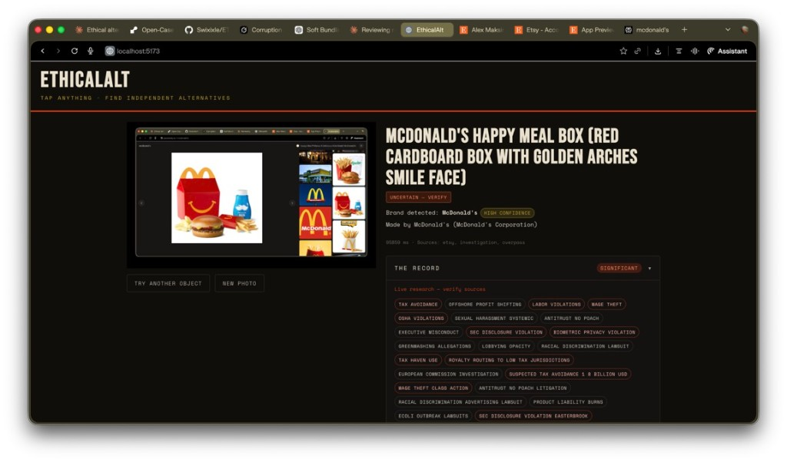
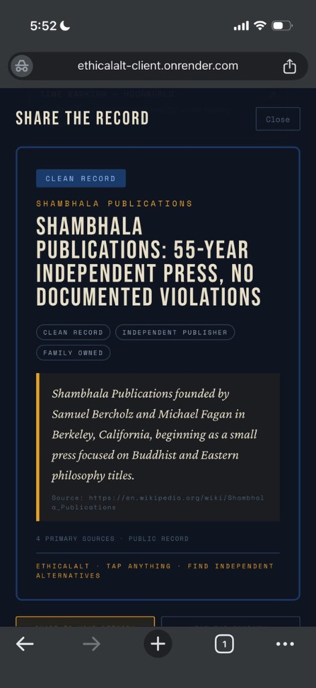
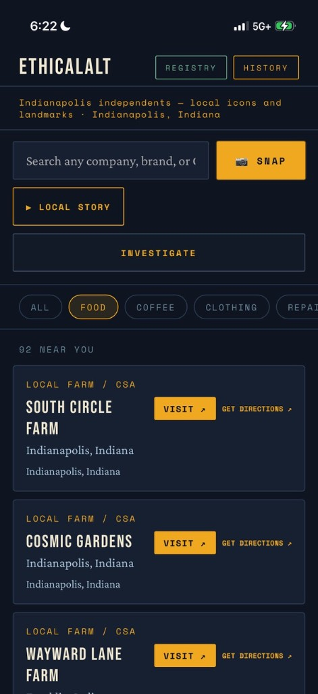

# EthicalAlt

**Point your camera at anything. Tap the brand. Get the record.**

Live at [ethicalalt-client.onrender.com](https://ethicalalt-client.onrender.com)

---

EthicalAlt is a mobile-first web app that turns your camera into an investigation. Point it at a product on a shelf, a storefront, a logo on a truck — tap the brand — and receive a structured record of that company's documented history across six categories: environmental violations, labor practices, political spending, legal settlements, tax structure, and product health.

Then find something better nearby.

---

## Screenshots

**Investigation with alternatives** — production: structured record, health callout, verified local options.


**The record** — identification, confidence, and verdict tags after a tap (local dev).



**Share the record** — exportable card for a clean or partial profile.



**Home** — search, snap, investigate, and nearby independents.



---

## How it works

```
Point camera → Tap brand → See the record → Find the alternative
```

1. **Point** — open the camera, aim at any product or scene
2. **Tap** — touch any brand in the frame. Hold for 600ms to isolate a specific object with a selection box
3. **Scan** — barcodes are detected automatically in the background. EAN, UPC, QR — no tap needed
4. **Identify** — Claude Vision resolves the brand and corporate parent; Gemini Vision independently corroborates with a weighted confidence score across three tracks
5. **Investigate** — structured profile loads across six categories with sourced findings and evidence grades
6. **Act** — verified independent alternatives surface from Etsy, local sellers, and nearby businesses

---

## The record

Every investigation produces a structured record across six categories:

| Category | What it covers |
|---|---|
| **Environmental** | EPA enforcement, spills, emissions violations, cleanup costs |
| **Labor** | OSHA violations, wage theft, union suppression, worker safety |
| **Legal** | Criminal convictions, civil settlements, regulatory actions |
| **Political** | Lobbying spend, PAC donations, revolving door hires |
| **Tax** | Effective rate vs statutory rate, offshore entities, subsidies |
| **Product Health** | Documented harms, recalls, ingredient concerns |

Each category gets an evidence grade — `established`, `strong`, `documented`, `alleged` — based on source quality and model corroboration. Nothing is presented as fact without a source. Every allegation section explicitly states the organization's documented response, or states that no formal response has been found.

---

## The Black Book

171 pre-investigated profiles across corporations, religious institutions, and nonprofits — available without a camera tap at `/library`.

Filter by type. Read the record. Find the alternative.

Profiles include ExxonMobil, Purdue Pharma, Volkswagen, Goldman Sachs, the Roman Catholic Church, the Southern Baptist Convention, the LDS Church, the Boy Scouts of America, Goodwill Industries, the NRA, and dozens more — each with sourced timelines, allegation responses, executive records, and documented community impact.

---

## Accuracy and governance

EthicalAlt is built around a documented research standard — [`RESEARCH_ALGORITHM.md`](./RESEARCH_ALGORITHM.md).

**What protects accuracy:**

- Every claim carries an evidence grade (`established` → `alleged`) based on source quality and model agreement
- Every allegation section states the organization's documented response, or explicitly states none was found
- A share risk tier is computed server-side on every investigation — high risk content is blocked from export, medium risk gets a mandatory disclaimer
- A three-track confidence scorer (documentary 0.5 / model agreement 0.3 / cross-reference 0.2) flags weak corroboration
- A corroboration script re-investigates every stored profile using live web search and diffs against stored facts
- Users can report factual errors directly from any investigation via the "report an error" link — all reports land in a reviewed queue

**What EthicalAlt is not:**

EthicalAlt is not a law firm. It is not a regulator. It is not a news organization. It is a mirror. Clean businesses get a clean record here. Companies with documented issues get a documented record. The mirror does not editorialize.

---

## Neutral by design

A business with a clean record gets a clean record — sourced, scored, and displayed with the same rigor as a heavy file. A 55-year independent press with no documented violations, family owned, four primary sources: that is the finding, and that is what gets published.

For honest independent businesses that is not a liability. It is free verified documentation that no marketing budget can replicate.

---

## Technical overview

**Stack:** React 19 + Vite (client) / Node.js + Express (server) / PostgreSQL (profiles)

**AI pipeline:**
- Vision: Claude Vision primary, Gemini Vision failover, crop enhancement (contrast + sharpen) on held selections
- Investigation: Claude multi-turn with web search (up to 10 searches), Perplexity + Gemini parallel fallback
- Confidence: three-track weighted scoring clamped 0.15–0.97
- Barcode: native BarcodeDetector API → Open Food Facts → brand lookup, bypasses vision entirely

**Cache layer:**
- Investigation results: 6 hour TTL, 300 max entries
- Barcode lookups: 24 hour TTL, 500 max entries
- City narrative: 24 hour TTL, 200 max entries

**Rate limiting:** 5 camera investigations per IP per 24 hours. Barcode scans and Black Book search are unlimited.

**Privacy:** Location is used only to find nearby independents. Never stored. Never sold. No account required.

---

## Research standard

Every profile follows [`RESEARCH_ALGORITHM.md`](./RESEARCH_ALGORITHM.md).

Core principle: if something happened, it should be verifiable. If something is claimed, there should be a receipt.

Three allegation response types:
- **Type 1** — documented denial or dispute (with source)
- **Type 2** — documented acknowledgment (with source)
- **Type 3** — no formal public response documented (stated explicitly, never silently omitted)

---

## Local development

```bash
# Install
npm install
cd client && npm install

# Environment
cp .env.example .env

# Run
npm run dev          # server on :3001
cd client && npm run dev   # client on :5173
```

**Required:**
```
ANTHROPIC_API_KEY=
DATABASE_URL=        # optional — degrades gracefully without it
```

**Optional:**
```
GEMINI_API_KEY=      # vision failover + parallel investigation fallback
PERPLEXITY_API_KEY=  # parallel investigation fallback + Layer C corroboration
ETSY_API_KEY=        # Etsy alternatives
```

---

## Status

Functional MVP. Pre-user acquisition phase.

- Camera tap → investigation pipeline: operational
- Barcode detection (EAN/UPC/QR): operational
- Hold-to-select with crop enhancement: operational
- Black Book (171 profiles): operational
- Local independents feed: operational
- City narrative on load: operational
- Rate limiting (5/day camera, unlimited barcode + search): operational
- Error reporting: operational
- Corroboration pass against live web search: ready to run
- Civic features (witness registry, worker profiles): built, currently parked

---

> *Clean businesses get a clean record here. Companies with documented issues get a documented record. The mirror does not editorialize.*
