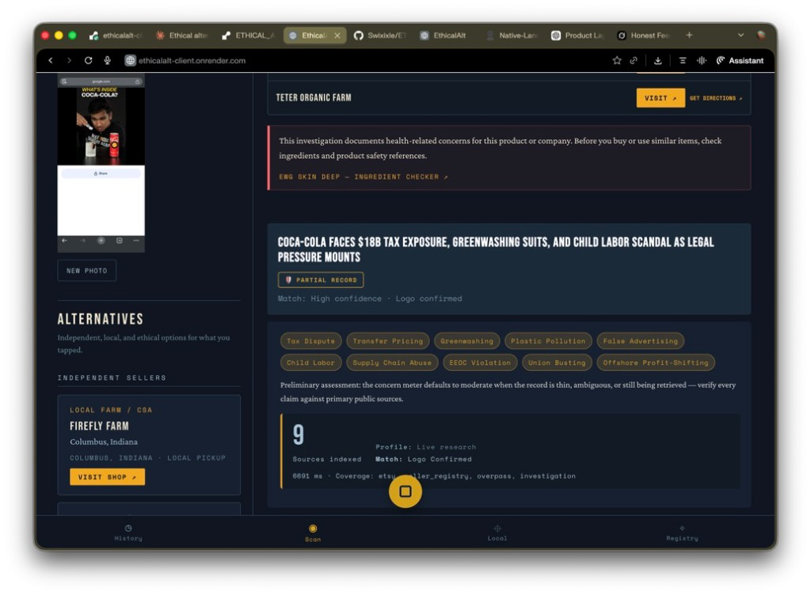
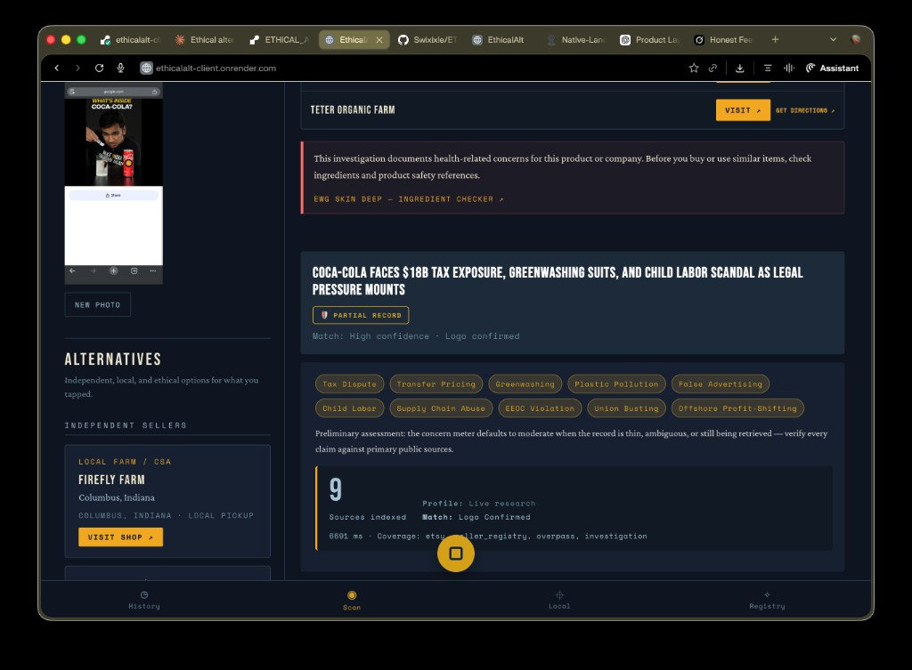
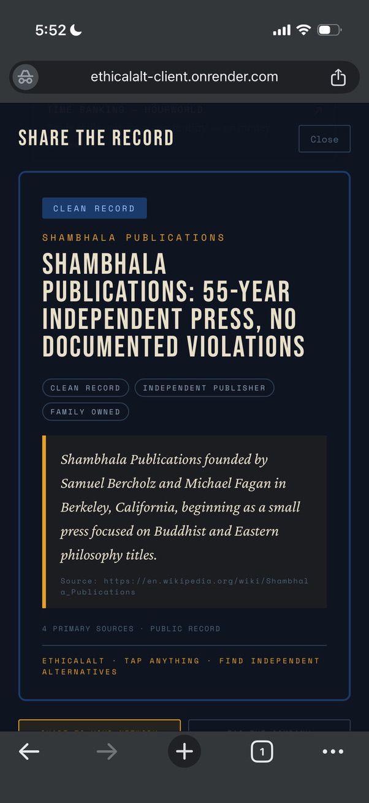
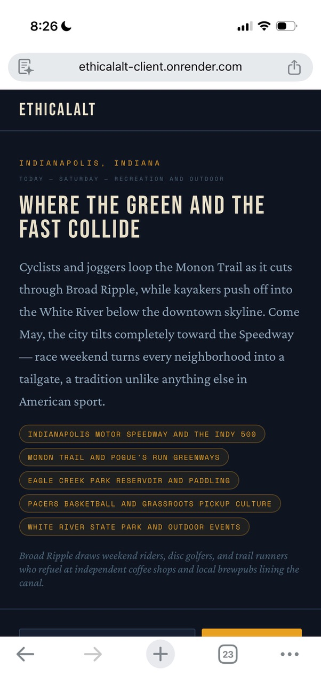

# EthicalAlt

**Photograph a product. Tap any item. Get a full corporate investigation record and verified local alternatives.**

<p align="center">
  
</p>
<p align="center"><em>Production build — tap flow with full investigation and local alternatives.</em></p>

**Current status:** Functional MVP — 90+ profiled brands, live AI investigation pipeline with three-model corroboration layer, civic witness and worker registries operational. Pre-user acquisition phase.

> EthicalAlt is not a law firm. It is not a regulator. It is not a news organization.
> It is a mirror. Clean businesses get a clean record here. Companies with documented issues get a documented record. The mirror does not editorialize.

Live at [url]

EthicalAlt is a mobile-first web app that turns your camera into a conscience. Point it at anything on a shelf, in a store window, or in your home — tap the brand — and receive a structured investigation of that company's environmental record, labor practices, political spending, and documented controversies, plus verified independent alternatives sourced from Etsy, local sellers, and nearby businesses.

<p align="center">
  
</p>
<p align="center"><em>Local dev — vision match, curated record tags, and source mix (Etsy, investigation, Overpass).</em></p>

---

## The core loop

```
Photograph → Tap object → Identify brand → Investigate → Act
```

1. **Photograph** — open the camera, point at any product or scene
2. **Tap** — touch any item in the frame
3. **Identify** — Claude Vision resolves the brand and corporate parent; Gemini Vision independently corroborates, producing a weighted confidence score across three tracks
4. **Investigate** — structured profile loads across six categories: environmental, labor, political, legal, tax, product health
5. **Corroborate** — Layer C inferences are spot-checked against Perplexity; each category gets its own confidence score with a visible breakdown
6. **Act** — verified independent alternatives surface; share the record; file a civic witness report; tag the company; report to regulators

---

## Screenshots

**1. Full investigation — desktop view (alternatives + accordion)**



---

**2. Clean record — Shambhala Publications**



A clean record is published with the same weight as a damaging one. For honest independent businesses this is free verified advertising — sourced, corroboration-scored, and publicly accessible in the investigation payload.

---

**3. City identity — Indianapolis**



---

## Neutral by design — it is a mirror

The investigation finds what it finds.

A business with a clean record gets a clean record — publicly stated, sourced, and shown with the same UI rigor as a heavy file. A 55-year independent press with no documented violations, family owned, four primary sources: that is the finding, and that is what gets published.

For honest independent businesses that is not a liability. It is free verified advertising that no marketing budget can replicate.

EthicalAlt is not an attack machine. It is a mirror. Corporations with bad records look bad in it. Businesses with clean records look clean in it. The mirror does not editorialize.

---

## How investigations are built — the guardrail system

Every investigation passes through seven layers before it reaches you. The full, user-facing breakdown is in [`docs/HOW_INVESTIGATIONS_WORK.md`](docs/HOW_INVESTIGATIONS_WORK.md). Share-risk enforcement for short-form social export is documented for reviewers in [`docs/SHARE_RISK_TIER_METHODOLOGY.md`](docs/SHARE_RISK_TIER_METHODOLOGY.md).

The short version:

**Layer 1 — Source extraction.** DB profiles are hand-curated against primary sources. Live research uses Claude's web search tool, not just training memory.

**Layer 2 — Vision corroboration.** Claude and Gemini independently identify the brand from the same image. Neither sees the other's answer first. Disagreement is a score penalty, not a midpoint.

**Layer 3 — Evidence grading.** Every finding is graded: stronger sections trace to primary sources; weaker sections carry explicit grades (including AI-inferred paths). Those distinctions stay visible in the UI and in the structured investigation payload.

**Layer 4 — Three-track confidence scoring.** Documentary anchor (50%), model agreement (30%), cross-reference adjustment (20%). Only documents can push a category above the high-confidence band in the documentary track; models act as a gate, not a substitute for citations.

**Layer 5 — Layer C corroboration.** Inferred / limited claims are spot-checked against Perplexity when keyed. Uncorroborated paths are downgraded and flagged visibly.

**Layer 6 — Structured output.** Investigations are normalized server-side: consistent fields, timestamps, evidence grades, corroboration flags, and category scores. Optional cryptographic signing of payloads is on the roadmap as receipt hardening — it is not a claim this repo makes today.

**Layer 7 — Share and distribution gates.** A server-computed `share_risk_tier` controls how aggressively short-form export is offered (including blocking TikTok-oriented export for `high`). No user photo is accepted or included in share API payloads. Server-side rules, not UI suggestions.

---

## What works today

| Feature | Status |
|---------|--------|
| Camera tap + brand identification | ✅ Working |
| Gemini Vision corroboration on identification | ✅ Working (with `GEMINI_API_KEY`) |
| Three-track confidence scoring (documentary + model agreement + cross-reference) | ✅ Working |
| Per-category confidence scores (corroboration path) | ✅ Working |
| Layer C Perplexity corroboration | ✅ Working (with `PERPLEXITY_API_KEY`) |
| Corporate investigation profiles (DB-backed, 90+ brands) | ✅ Working |
| Live AI investigation (Claude primary) | ✅ Working |
| AI provider failover (Claude → Perplexity → Gemini) | ✅ Working |
| Risk tier assignment + server-side social share gating | ✅ Working |
| Local independents feed with category filters | ✅ Working |
| Etsy + Overpass alternatives | ✅ Working |
| Proportionality tool (USSC/BOP reference) | ✅ Working |
| Share record / tag company / report to regulators | ✅ Working |
| City identity + local narrative layer | ✅ Working |
| Civic witness registry | ✅ Working |
| Hire-direct worker registry | ✅ Working |
| Native Land territory layer | ✅ Working |
| Community board (notice board, bottom of feed) | ✅ Working |

---

## Tech stack

| Layer | Choice |
|-------|--------|
| API | Express (Node ≥ 20, ESM) |
| UI | React 19 + Vite 6 |
| AI — vision + investigation | Claude (primary) → Perplexity → Gemini (failover) |
| Vision corroboration | Gemini (e.g. `gemini-2.0-flash`, configurable) |
| Text corroboration | Perplexity (e.g. Sonar family, configurable) |
| Confidence scoring | Three-track: documentary anchor, model agreement, cross-reference |
| Database | PostgreSQL (optional — degrades gracefully without it) |
| Alternatives | Etsy API + Overpass (OpenStreetMap) |
| Local data | Native Land API, Eventbrite, Bandcamp |
| Monorepo | npm workspaces (`client/`, `server/`) |

---

## Quick start

### Prerequisites

- Node ≥ 20
- PostgreSQL (optional — most features work without it)
- An Anthropic API key (required for vision + investigation)

### 1. Clone and install

```bash
git clone https://github.com/Swixixle/ETHICAL_ALTERNATIVES.git
cd ETHICAL_ALTERNATIVES
npm install
```

### 2. Configure environment

```bash
cp server/.env.example server/.env
```

Open `server/.env` and set at minimum:

```env
ANTHROPIC_API_KEY=sk-ant-...
```

Everything else is optional. The app runs without a database — profiles fall back to live AI generation. Features requiring persistence degrade gracefully.

### 3. Run

```bash
npm run dev
```

- Client: `http://localhost:5173`
- API: `http://localhost:3001`

### With database (full features)

```bash
createdb ethicalalt
# Add DATABASE_URL to server/.env
psql ethicalalt < server/db/schema.sql
node server/db/import_profiles_v2.mjs
```

---

## How it works

### Investigation pipeline

```
Image + tap coordinates
        ↓
  vision.js — Claude identifies brand, confidence, scene context
        ↓
  visionCorroboration.js — Gemini independently identifies (when keyed)
        ↓
  confidenceScorer.js — three-track weighted score
  Track 1: documentary anchor (50%) — source count, court records, DB profile
  Track 2: model agreement (30%)    — gate score, not average
  Track 3: cross-reference (20%)     — compounding bonus/penalty
        ↓
  investigation.js — slug resolution, DB hydration or live Claude research
        ↓
  normalizeInvestigation() + finalizeInvestigation()
        ↓
  corroboration.js — Layer C claims spot-checked against Perplexity (when keyed)
  each category can attach: final_confidence, confidence_breakdown, model findings
        ↓
  attachProportionality() — USSC/BOP reference if violation metadata present
        ↓
  Investigation payload → client (includes identification corroboration + Layer C fields)
```

### Layer A / B / C (semantic)

Investigations mix **primary-sourced material** with **model inference**. In the data model, stronger claims should trace to citations; weaker sections carry evidence grades. **Layer C**-style inferences are the ones the corroboration pass targets: limited / alleged grades (and similar), then rescored with documentary + model + cross-reference tracks so the number is not an arbitrary middle.

### Confidence scoring — why it is not 40–80% purgatory

The three tracks are not averaged. They compound:

- **Documentary anchor** is the only track that can push confidence above 85%. Models cannot. Documents can. 10+ sources with a court record reaches 0.93 before the other tracks run.
- **Model agreement** is a gate, not a midpoint. Both models agree at high confidence: 0.90. Explicit disagreement: 0.25. One model found nothing: 0.50.
- **Cross-reference** adds or subtracts based on whether the photo and documents reinforce each other. Photo matches documented brand profile: +0.15. Photo contradicts documented profile: −0.25.

A brand with strong documentary support, model agreement, and photo match can legitimately reach the high band. A contested identification with thin documentary support can land in the low band. The range reflects the inputs, not a default middle.

---

## Project structure

```
ETHICAL_ALTERNATIVES/
├── server/
│   ├── index.js
│   ├── env.js                        # loads server/.env
│   ├── routes/
│   │   ├── tap.js                    # core camera flow
│   │   └── ...
│   ├── services/
│   │   ├── vision.js                 # brand identification
│   │   ├── visionCorroboration.js    # Gemini second opinion
│   │   ├── confidenceScorer.js       # three-track scoring
│   │   ├── investigation.js         # profile assembly + AI research
│   │   ├── corroboration.js          # Layer C Perplexity check
│   │   ├── aiProvider.js             # Claude → Perplexity → Gemini failover
│   │   └── proportionality.js         # USSC/BOP deterministic scoring
│   └── db/
│       ├── schema.sql
│       └── pool.js
│
├── client/
│   └── src/
│       ├── App.jsx                   # mode router
│       ├── hooks/
│       │   └── useTapAnalysis.js
│       └── components/               # cards, home, share, board, etc.
│
├── docs/
│   ├── HOW_INVESTIGATIONS_WORK.md    # public methodology (users, press, counsel)
│   ├── SHARE_RISK_TIER_METHODOLOGY.md
│   └── screenshots/
│
└── render.yaml                       # Render blueprint (API + static client)
```

---

## Environment variables

**Required:**

```env
ANTHROPIC_API_KEY=
```

**Recommended:**

```env
DATABASE_URL=
GEMINI_API_KEY=                      # vision fallback + vision corroboration
PERPLEXITY_API_KEY=                  # investigation text fallback + Layer C corroboration
ETSY_API_KEY=                        # alternatives
```

**Optional (each unlocks a specific feature):**

```env
GEMINI_VISION_MODEL=gemini-2.0-flash
PERPLEXITY_CORROBORATION_MODEL=sonar
ANTHROPIC_INVESTIGATION_MODEL=
ANTHROPIC_VISION_MODEL=
NATIVE_LAND_API_KEY=
EVENTBRITE_API_KEY=
NEWS_API_KEY=
CORS_ORIGIN=
PORT=3001
```

Run `grep -r "process.env" server/` for the complete list.

---

## API surface

| Method | Path | Description |
|--------|------|-------------|
| GET | `/health` | Liveness |
| GET | `/api/health/providers` | AI provider status |
| POST | `/api/tap` | Image + tap → brand identification + corroboration |
| POST | `/api/tap/investigation` | Investigation profile |
| POST | `/api/tap/sourcing` | Alternatives bundle |
| POST | `/api/investigate` | Investigation by brand name (no image) |
| GET | `/api/history` | Tap history |
| GET | `/proportionality` | Deterministic sentencing reference |
| * | `/api/profiles/*` | Brand profile directory |
| * | `/api/sellers/*` | Independent seller registry |
| * | `/api/witness/*` | Civic witness submissions |
| * | `/api/workers/*` | Hire-direct worker registry |
| * | `/api/board/*` | Community board |
| * | `/api/local-feed/*` | Local business + chain filter |
| * | `/api/territory/*` | Native Land + narrative |
| * | `/api/events/*` | Local events |
| * | `/api/documentary/*` | SSE documentary narration |
| POST | `/api/share-card` | Share artifact builder — risk-gated, no photo in payload |
| POST | `/api/share-export` | Alternate share payload path — same photo / tier guards |
| * | `/api/city-identity/*` | City identity + local narrative |

---

## Challenging or correcting an investigation

If you believe an investigation contains a factual error, use the contact in the app (`hello@ethicalalt.com` unless overridden at build time) or open an issue on this repository with the brand, the specific sentence or field, why you believe it is wrong, and links to primary sources. This is a **manual** process today: there is structured logging for product events, but there is not yet a dedicated in-app dispute queue with SLA tooling.

EthicalAlt does not guarantee turnaround time. The corroboration layer reduces how often opaque inference ships; it does not eliminate errors.

**Lawyer review pending:** Terms of service, share-flow disclaimers, and on-card copy have not been reviewed by legal counsel. Operational policy around disputes and takedowns should be finalized with counsel before a broad public launch.

---

## Honest gaps

| Gap | Notes |
|-----|-------|
| No auth layer | Session-scoped only; rate-limited but unauthenticated |
| No automated tests | Manual verification throughout |
| Camera API reliability | `getUserMedia` on mobile Safari is fragile |
| Mobile web, not native | Browser-based; no React Native or Capacitor yet |
| No unified request tracing | `console` logging only in investigation path |
| No docker-compose | Local Postgres setup is manual |
| Profile corpus is static | 90+ brands hand-curated; search and scale need indexing |
| Dispute process is manual | Contact-driven; dedicated dispute workflow and admin tooling not shipped yet |
| Lawyer review pending | External language (TOS, share disclaimers, card text) has not been reviewed by legal counsel |

---

## Risks

**AI investigation accuracy.** Claude can be wrong. Evidence grades, profile type (`database` vs live), and the corroboration layer make uncertainty explicit and structured. Treat investigations as starting points for research, not verdicts.

**Legal exposure on corporate records.** Every factual claim needs a source. DB-backed profiles should trace to primary citations. Live-generated text must be verified against primary materials. Layer C paths are explicitly weaker and are spot-checked with a second model when Perplexity is keyed; that reduces opaque inference but does not remove legal diligence.

**Defamation surface.** An investigation that contains a false statement of fact about a named company, repeated at scale, creates exposure regardless of technical care in generation. The dispute path, risk-tier gating for certain exports, and conservative share copy are operational responses — they are necessary but not sufficient. Counsel review of publisher-facing language remains the critical next step.

**Data privacy.** The app handles location data, camera images, and user-submitted witness reports. There is no formal privacy policy or GDPR/CCPA compliance layer yet. This is pre-launch — these must be addressed before a broad public release.

**Camera and tap on mobile web.** `getUserMedia` on Safari in PWA mode is unreliable. Tap precision on small screens is a known UX problem. The architecture supports a native wrapper when the web version proves the product.

**No user load yet.** This is a serious prototype. It has not faced real adversarial use, concurrent load, or edge cases at scale.

---

## Roadmap

### Now
- Client-side confidence pills and breakdown UI (per-category scores visible in accordion)
- In-app “challenge this record” flow wired to the same dispute policy described above
- Docker Compose for one-command local dev
- Mobile Safari camera reliability
- Unified request ID tracing
- Lawyer review of TOS, share disclaimer, and card text

### Next
- Journalist and civic org outreach — direct contact
- Profile corpus expansion toward top 500 consumer brands
- Privacy policy and data retention documentation
- PWA manifest + install prompt

### Later
- Native wrapper (Capacitor) when mobile web limits become the bottleneck
- Community profile contributions with moderation queue
- Optional cryptographic signing of investigation payloads (receipt hardening)

---

## Contributing

Solo project in active development. Issues and PRs are welcome but reviewed slowly.

If you are a journalist, researcher, or investigator using this for real work — reach out directly. The share-to-regulator and witness registry features exist for you.

---

## Community board

The community board lives at the bottom of the main feed. Local posts from verified accounts in your area, sorted by distance. No algorithmic ranking. No engagement mechanics. It lists posts. It does not match people, process payments, or screen anyone.

---

## License

MIT — see `LICENSE`.

---

*Built by Nikodemus Systems — Indianapolis.*

*Procedural Trust Infrastructure: if something happened, it should be verifiable. If something is claimed, there should be a receipt.*
