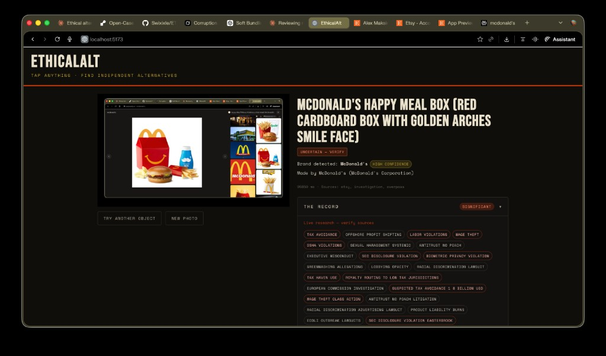
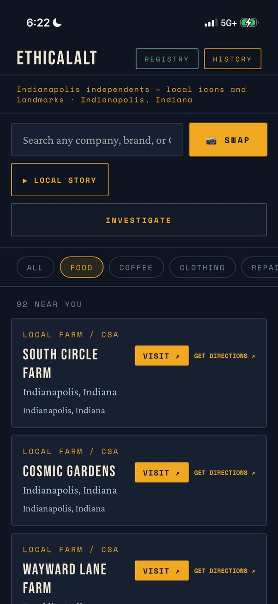
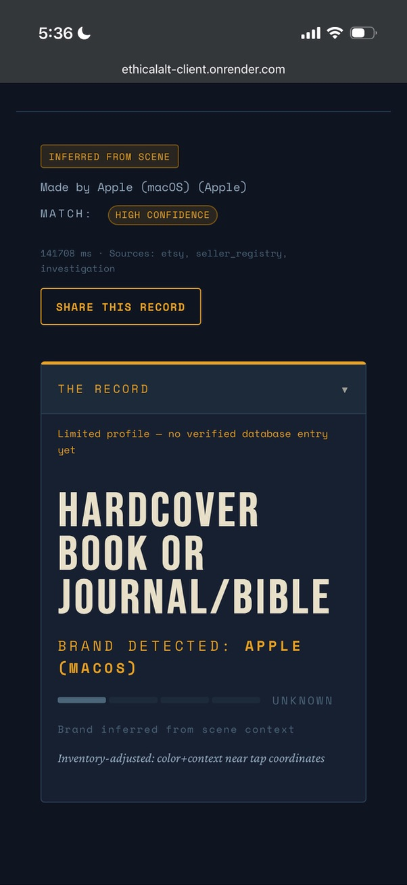

<div align="center">

# ETHICALALT

**Photograph a product. Tap any item. Get a full corporate investigation record and verified local alternatives.**

[](https://ethicalalt-client.onrender.com)
[](LICENSE)

</div>

EthicalAlt is a mobile-first web app that turns your camera into a conscience. Point it at anything on a shelf, in a store window, or in your home — tap the brand — and receive a structured investigation of that company's environmental record, labor practices, political spending, and documented controversies, plus verified independent alternatives sourced from Etsy, local sellers, and nearby businesses.

| **McDonald’s** — tap a mass-market product; the record shows what’s in the file | **Shambhala Publications** — same flow when the public record is clean; shareable, sourced |
|:-:|:-:|
|  |  |

The investigation is not opinion. It is a structured record with sourced evidence, graded by confidence, with clear separation in the UI between **database** profiles and **live** research so you know what to verify.

---

## The core loop

```
Photograph → Tap object → Identify brand → Investigate → Act
```

1. **Photograph** — open the camera, point at any product or scene
2. **Tap** — touch any item in the frame
3. **Identify** — vision AI resolves the brand and corporate parent with a confidence score
4. **Investigate** — structured profile loads: environmental record, labor record, political donations, documented violations, proportionality context
5. **Act** — verified independent alternatives surface; share findings; file a civic witness report

---

## Screenshots

**1. Home — local feed with category filters and SNAP**



The entry point. Local independent businesses near you, filterable by category. The SNAP button opens the camera. The INVESTIGATE bar accepts a brand name directly if you already know what you're looking at.

---

**2. Full investigation view — desktop (product photo + record)**

The same desktop layout as in the pair above: evidence on the right, context and imagery on the left. Heavier files show verdict tags and section grades; clean files show the same chrome with nothing to bury.


---

**3. City identity — local narrative layer (Indianapolis)**


The city identity layer surfaces a curated narrative about the local area — landmarks, culture, outdoor life, independent institutions. Not algorithmic. Not scraped. Written by the model from public record and edited for accuracy.

---

**4. Brand identified — inferred from scene**



The vision step returns a confidence score and a method label. **High confidence** means the brand was read directly. **Inferred from scene** means it was resolved from object type, visual context, and surroundings. Both can be correct — only the label changes, and the label is always shown.

---

## Neutral by design — it is a mirror

The investigation finds what it finds.

A business with a clean record gets a clean record — publicly stated, sourced, and shown with the same UI rigor as a heavy file. A 55-year independent press with no documented violations, family owned, four primary sources: that is the finding. That is what gets published.

For honest independent businesses, that is not a liability. It is free verified advertising that no marketing budget can replicate. A public record saying your company has no documented labor findings, no environmental findings, no political entanglements — that is worth something. It is worth more than a review, because it comes from public record, not from a customer mood.

EthicalAlt is not an attack machine. It is a mirror. Corporations with bad records look bad in it. Businesses with clean records look clean in it. The mirror does not editorialize.

---

## What works today

| Feature | Status |
|---------|--------|
| Camera tap + brand identification | ✅ Working |
| Corporate investigation profiles (DB-backed) | ✅ Working |
| Live AI investigation (Claude + fallbacks) | ✅ Working |
| Confidence scoring + evidence grading | ✅ Working |
| Local independents feed with category filters | ✅ Working |
| Etsy alternatives | ✅ Working |
| Local business alternatives (Overpass) | ✅ Working |
| Proportionality tool (USSC/BOP reference) | ✅ Working |
| Share to network / tag company / report to regulators | ✅ Working |
| City identity + local narrative layer | ✅ Working |
| Civic witness registry | ✅ Working |
| Hire-direct worker registry | ✅ Working |
| Local events + Native Land territory layer | ✅ Working |
| Community board (notice board, bottom of feed) | ✅ Working |

---

## Tech stack

| Layer | Choice |
|-------|--------|
| API | Express (Node ≥ 20, ESM) |
| UI | React 19 + Vite 6 |
| AI — vision + investigation | Claude (primary) → Perplexity → Gemini (failover) |
| Database | PostgreSQL (optional — degrades gracefully without it) |
| Alternatives | Etsy API + Overpass (OpenStreetMap) |
| Local data | Native Land API, Eventbrite, Bandcamp |
| Monorepo | npm workspaces (`client/`, `server/`) |

---

## Quick start

### Prerequisites

- Node ≥ 20
- PostgreSQL (optional — most features work without it)
- An [Anthropic API key](https://console.anthropic.com) (required for vision + investigation)

### 1. Clone and install

```bash
git clone https://github.com/Swixixle/ETHICAL_ALTERNATIVES.git
cd ETHICAL_ALTERNATIVES
npm install
```

### 2. Configure environment

```bash
cp server/.env.example server/.env
```

Open `server/.env` and set at minimum:

```env
ANTHROPIC_API_KEY=sk-ant-...
```

Everything else is optional. The app runs without a database — investigation profiles fall back to live AI generation, and civic features that require persistence are gracefully disabled.

### 3. Run

```bash
npm run dev
```

- Client: `http://localhost:5173`
- API: `http://localhost:3001`

### With database (full features)

```bash
createdb ethicalalt

# Add to server/.env:
DATABASE_URL=postgresql://localhost:5432/ethicalalt

# Initialize schema (adjust path if your process differs)
psql ethicalalt < server/db/schema.sql

# Optional: seed sample profiles
node server/db/import_profiles_v2.mjs
```

---

## How it works

### Investigation pipeline

```
Image + tap coordinates
        ↓
  vision.js — brand ID, confidence score, scene inventory
        ↓
  investigation.js — slug resolution
        ↓
  [DB profile exists?]
     YES → hydrate relational profile + optional JSON override
     NO  → live Claude research with web search tool loop
        ↓
  normalizeInvestigation() — canonical shape
        ↓
  finalizeInvestigation() — slug, press outlets, concern flags, timestamp
        ↓
  [violation metadata present?]
     YES → attachProportionality() — USSC reference + nearest BOP facility
        ↓
  Investigation payload → client
```

The AI provider layer handles failover transparently. If Claude is unavailable, Perplexity covers the text leg; Gemini covers vision fallback when keyed.

### Evidence and confidence

Per-section **evidence grades** and **profile type** (`database` vs realtime search) make uncertainty explicit. Treat live-generated text as a **starting point** — verify material claims against primary sources.

---

## Project structure

```
ETHICAL_ALTERNATIVES/
├── server/
│   ├── index.js                      # Entry point, route mounting
│   ├── env.js                        # Environment loader
│   ├── routes/
│   │   ├── tap.js                    # /api/tap — core camera flow
│   │   ├── profiles.index.route.js
│   │   ├── sellers.js
│   │   ├── witness.js
│   │   ├── workers.js
│   │   ├── communityBoard.js         # /api/board — notice board
│   │   └── ...
│   ├── services/
│   │   ├── vision.js                 # Brand identification from image
│   │   ├── investigation.js          # Profile assembly + AI research
│   │   ├── aiProvider.js             # Claude → Perplexity → Gemini failover
│   │   └── proportionality.js        # USSC/BOP deterministic scoring
│   └── db/
│       ├── schema.sql
│       └── pool.js                   # null when DATABASE_URL is absent
│
├── client/
│   └── src/
│       ├── App.jsx                   # Mode router — URL + in-app state
│       ├── hooks/
│       │   └── useTapAnalysis.js     # Core camera → investigation orchestration
│       └── components/               # Cards, home, share, board, etc.
│
└── docs/
    └── screenshots/                  # README figures (jpeg + one png)
```

---

## Environment variables

**Required:**

```env
ANTHROPIC_API_KEY=
```

**Recommended:**

```env
DATABASE_URL=
PERPLEXITY_API_KEY=          # investigation text fallback
GEMINI_API_KEY=              # vision fallback
ETSY_API_KEY=                # alternatives
```

**Optional (each unlocks a specific feature):**

```env
NATIVE_LAND_API_KEY=
EVENTBRITE_API_KEY=
NEWS_API_KEY=
ANTHROPIC_INVESTIGATION_MODEL=
ANTHROPIC_VISION_MODEL=
CORS_ORIGIN=
PORT=3001
```

The app does not crash on missing optional keys. Run `grep -r "process.env" server/` for the full list.

---

## API surface

| Method | Path | Description |
|--------|------|-------------|
| GET | `/health` | Liveness |
| GET | `/api/health/providers` | AI provider status |
| POST | `/api/tap` | Image + tap → brand identification |
| POST | `/api/tap/investigation` | Investigation profile |
| POST | `/api/tap/sourcing` | Alternatives bundle |
| POST | `/api/investigate` | Investigation by brand name (no image) |
| GET | `/proportionality` | Deterministic sentencing reference |
| * | `/api/profiles/*` | Brand profile directory |
| * | `/api/sellers/*` | Independent seller registry |
| * | `/api/witness/*` | Civic witness submissions |
| * | `/api/workers/*` | Hire-direct worker registry |
| * | `/api/board` | Community notice board (GET/POST) |
| * | `/api/local-feed/*` | Local business + chain filter |
| * | `/api/territory/*` | Native Land + narrative |
| * | `/api/events/*` | Local events |
| * | `/api/documentary/*` | SSE documentary narration |
| * | `/api/share-card/*` | Share artifact builder |
| * | `/api/city-identity/*` | City identity + local narrative |

---

## Honest gaps

| Gap | Notes |
|-----|-------|
| No unified request tracing | `console` logging in investigation path only |
| No automated tests | Manual verification throughout |
| Camera API reliability | `getUserMedia` behavior varies on mobile — Safari is the worst offender |
| Mobile web, not native | UI is mobile-first but runs in a browser; no React Native or Capacitor yet |
| Profile corpus is static | Scale and search will eventually need an indexing strategy |
| No auth layer | Session-scoped only; civic features are rate-limited but unauthenticated |
| No docker-compose | Local setup requires manual Postgres provisioning |

---

## Risks

**AI investigation accuracy.** The live AI path uses Claude with web search. Claude can be wrong. Evidence grades and profile-type labeling are there so uncertainty is visible — treat `overall_concern_level` as a structured starting point for research, not a verdict.

**Legal exposure on corporate records.** Every factual claim needs a source. DB profiles are hand-curated with citations. Live-generated profiles should be verified against primary materials. This is the primary ongoing operational risk.

**Camera and tap on mobile web.** `getUserMedia` on Safari in PWA mode is fragile. Tap precision on small screens is a real UX problem. The architecture supports a native wrapper when the web version proves the product.

**No significant user load yet.** This is a serious prototype. It has not faced real adversarial use, scale, or edge cases.

---

## Roadmap

### Now
- Unified request ID tracing through the investigation pipeline
- Docker Compose for one-command local dev
- Basic E2E test coverage for the tap → investigate flow
- Mobile Safari camera reliability fixes

### Next
- Journalist and civic org outreach — direct contact, not PR
- Profile corpus expansion toward top 500 consumer brands
- PWA manifest + install prompt

### Later
- Native wrapper (Capacitor) when mobile web limits become the bottleneck
- Community profile contributions with moderation queue
- Expanded alternatives: co-ops, local business registry

---

## Contributing

Solo project in active development. Issues and PRs are welcome but reviewed slowly.

If you're a journalist, researcher, or investigator using this for real work — reach out directly. The share-to-regulator and witness registry features exist for you.

---

## Community board

The notice board lives at the **bottom of the main feed**. Same-day **offers** and **needs** (help / labor) with contact info; posts can be sorted by distance when the client sends coordinates. **No algorithmic ranking, no engagement mechanics.** It only lists posts — it does not match people, process payments, or verify identities. Neighbors coordinate on their own.

---

## License

MIT — see `LICENSE`.

---

*Built by [Nikodemus Systems](https://github.com/Swixixle) — Indianapolis.*

*If something happened, it should be verifiable. If something is claimed, there should be a receipt.*
